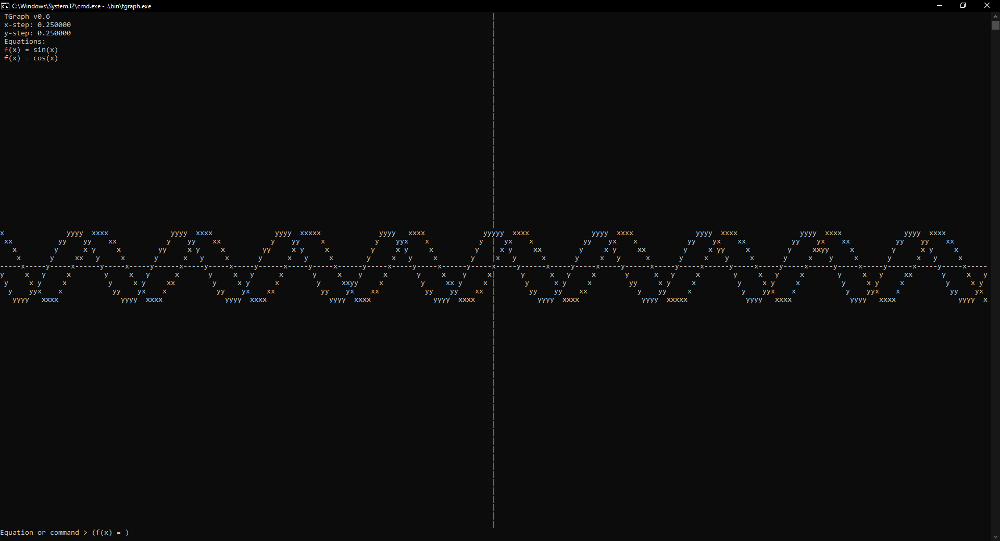
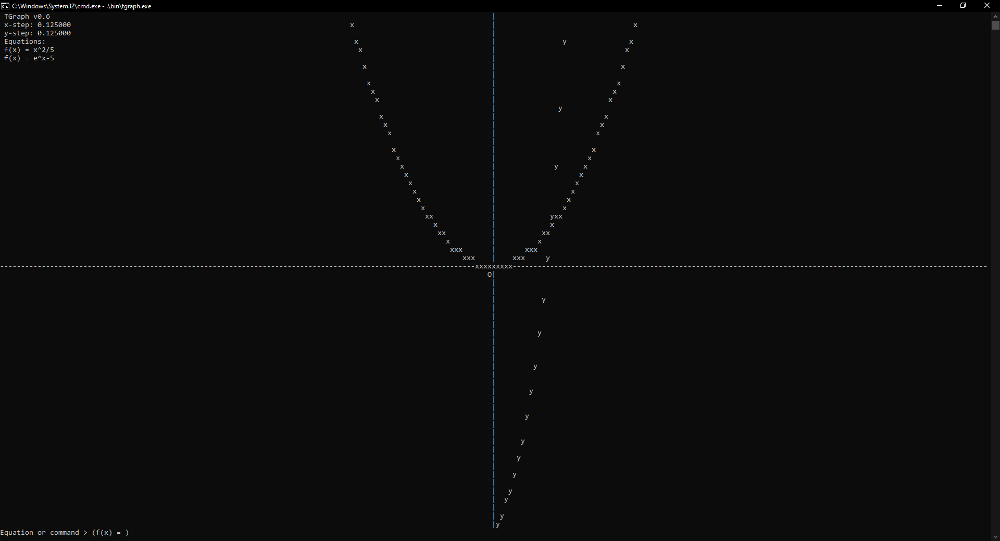
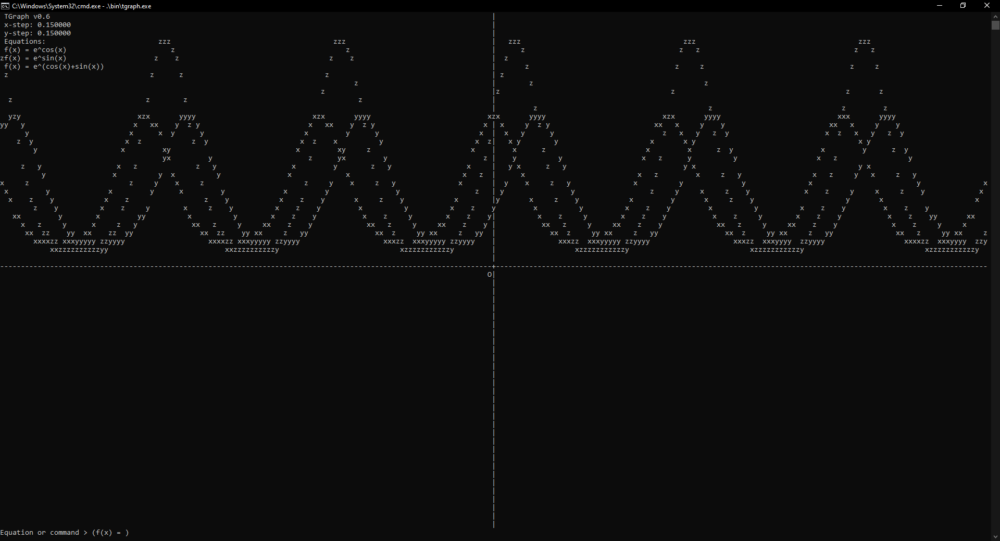

# TGraph

### A graphing simulator built for terminals.

## About

TGraph is a simple graphing simulator built for terminals. It implements in C++ a Pratt parser to evaluate expressions and generate opcodes. It also implements a simple stack virtual machine to interpret these opcodes.

## Features

- Runs on Windows, Linux, and MacOS
- Creates a rendered graph right in the terminal
- Interactive command-line interface and command-line argument support
- Supports all basic math operations
- Support for variables, built-in functions (e.g. sin, cos, tan, etc.), common constants (pi, e, etc.)

## Installation

TGraph can be compiled directly from the source code using make. Grab a copy and run make to get started.

```bash
make
```

To run TGraph, run the executable.

```bash
.\bin\tgraph.exe
```


or if you are on Linux,

```bash
./bin/tgraph
```

TGraph supports some command line arguments. Normal commands may be entered as command line arguments and they will be entered sequentially.

```bash
.\bin\tgraph.exe "sin(x)"
```

'and' designates a separator between commands.

```bash
.\bin\tgraph.exe x - 2 and "cos(x)" and "save file.txt" and "exit"
```

### \*Quotations are only necessary if the mathematical symbol has functionality in the terminal.

## Examples

### Sine and Cosine

```bash
.\bin\tgraph.exe "+" and "+" and "sin(x)" and "cos(x)"
```



### Quadratic and Exponential

```bash
.\bin\tgraph.exe "+" and "+" and "+" and "x^2/5" and "e^x-5"
```



### More Complex Expressions

```bash
.\bin\tgraph.exe "xstep 0.15" and "ystep 0.15" and "e ^ cos(x)" and "e ^ sin(x)" and "e ^ (cos(x) + sin(x))"
```



## License and Contributions

TGraph is licensed under the MIT license. You are free to use, modify, and redistribute TGraph as you see fit.

TGraph is open-source and welcomes community contributions if you see a bug or wish to implement a feature.

```

```
